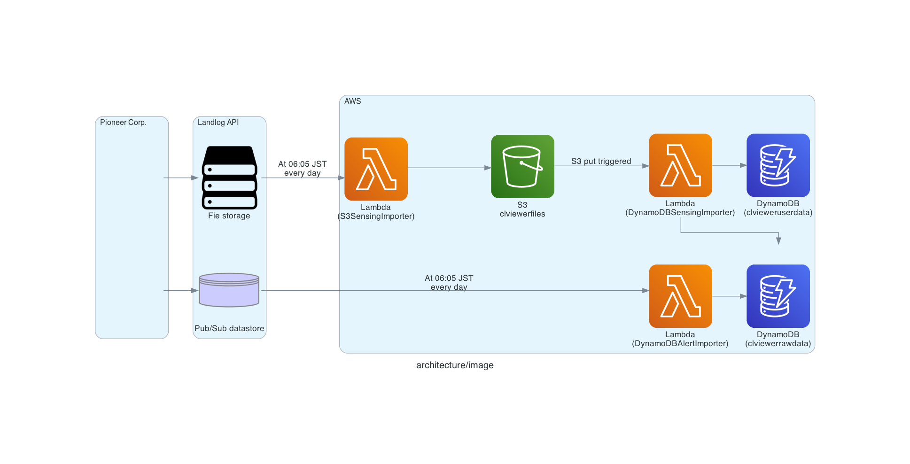

# cl-viewer-backend

## Architecture


- how to update architecture image

```
$ make pip-install
$ make generate-architecture
```

## Local Development
### Lambda function
- create `.env` in each function directory
  - clviewerdynamodbalertimporter
  - clviewerdynamodbimporter
  - clviewers3sensingimporter
```
$ make init-env
```
- invoke function in local

```
$ amplify mock function
```

### Api
- start local server
```
$ make setup-api
$ make start
```

## API Doc
### Open Swagger UI
```
$ make swagger-open
```
